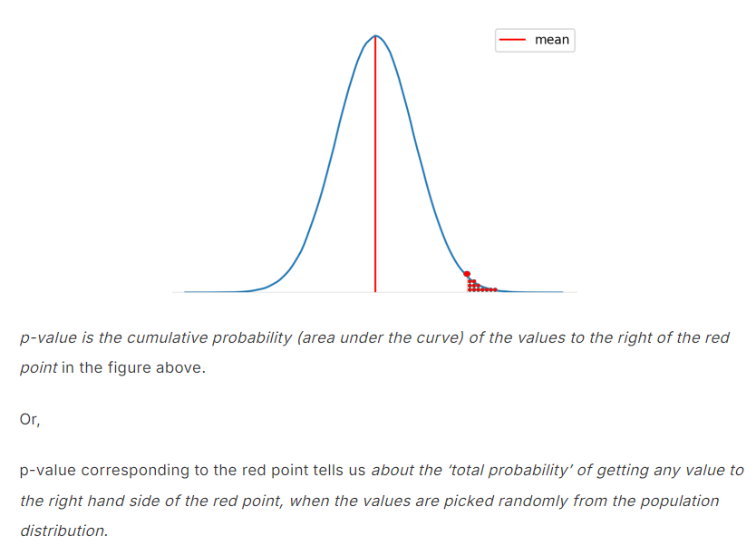
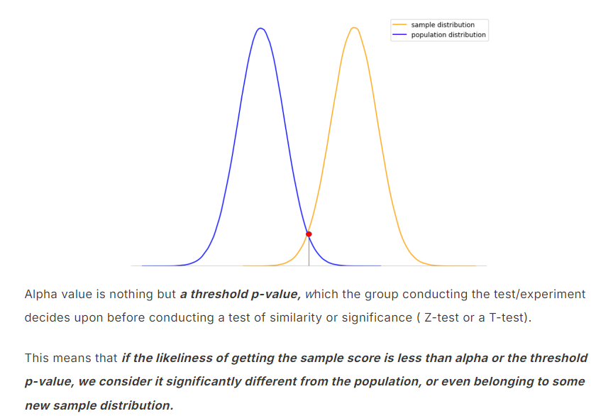

# Hypothesis Testing

Hypothesis testing is a statistical framework uses to make inferences about populations based on sample data. Its more theoretical in a way. When it comes to real life application part mostly A/B testing is used, both are different in a way not completely, one way to put is as Hypothesis testing involves broader range of statistical tests to make decisions or make inferences including, but not limited to A/B testing.

My understanding is that typically in EDA process, after checking the correlation between variables, hypothesis testing can be done to check its statistical significance, to provides statistical evidence for the claim.

**Applications:** Marketing, Social Sciences, Sports Analytics, Pharmaceuticals etc…

This process involves few steps:

1. Defining the problem statement or statement that we want to check is either correct or not.

   Ex: Does studying hours impact the student's marks?
2. Then defining the Null and Alternate Hypothesis.

   Null Hypothesis(H0): Studying hours has NO impact on students marks

   Alternative Hypothesis(H1): Studying hours has an impact on students marks.

   **NOTE:** Null Hypothesis(H0): We pick the null hypothesis which is easier to simulate. (or) The hypothesis that there no difference between the things is called as Null Hypothesis.
3. Set the level of significance (Alpha value)

   Generally it is decided by domain experts, but mostly used is 5% which is 0.05. It depends on the application like if we are checking 	for medical experiment, we can't afford to have more False Positives, alpha value should be small, but if we want to check if an ice cream truck arrives on time or not then we can consider 0.2 as alpha value also. That suggests we can afford to have False positives 2 out of 10 times.
4. Make a decision.

   This can be done in 2 ways, either by  calculating test statistic score and citical value or by calculating **p-value**. One catch is that if we are doing this using test statistic we have to impute critical value also. Where as p-value itself it enough as it can be compared to alpha value. (if p-value is less than alpha value, we reject the null hypothesis.)

**Terminologies:**

**Confusion Matrix:** The confusion matrix tells us how accurate ML algorithm predicts. The size of the confusion matrix is predicted by the no of variables we predict.

**False Positive**: Getting a small P-value when there is no difference is called false positive. Smaller P-value does not imply the affect size. Also known as Type 1 error.(we reject the null hypothesis when it is true)

**False Negative**: Also known as Type 2 error.(we fail to reject the null hypothesis when it is false)

**P-value**: 

**Alpha value**: 

